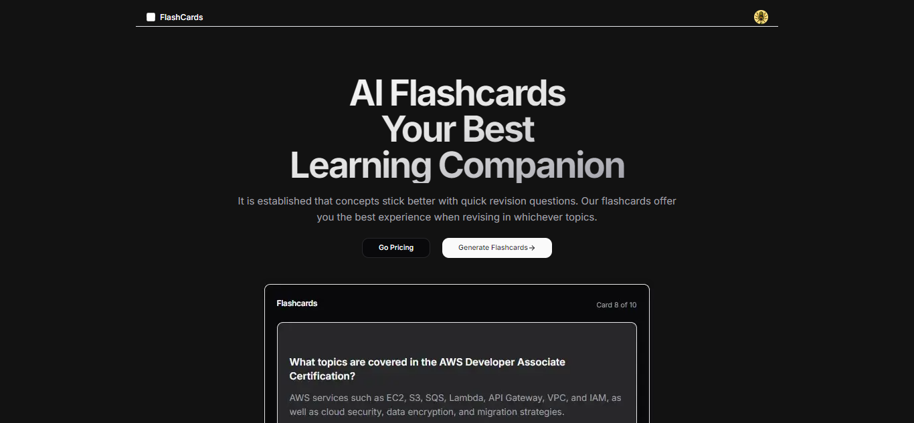
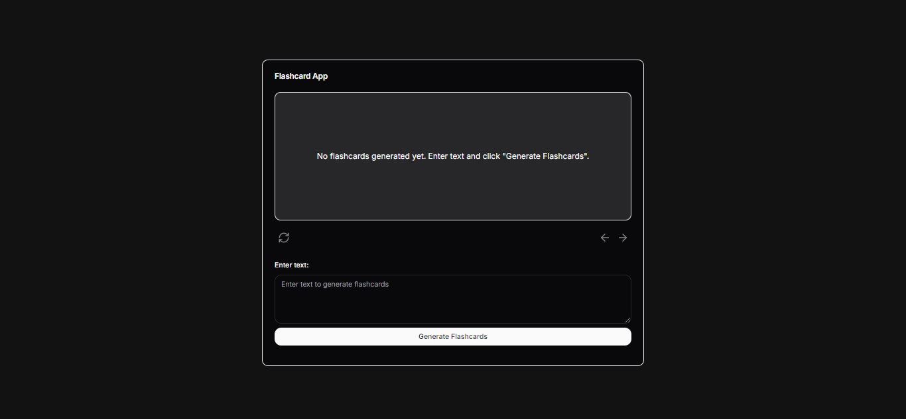
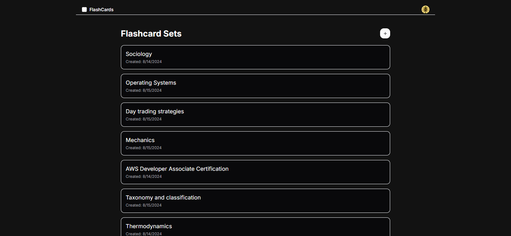

# AI Flashcards SAAS

## Project Overview

This is a flashcard SaaS built with Next.js, Clerk, Firebase, OpenAI, and Stripe.
Demo: <https://flash-cards-five-xi.vercel.app/>

## Technologies

- Next.js - React Framework
- Shadcn UI - Components
- Clerk - Authentication
- Firebase - Database
- OpenAI - LLM(genAI)
- TailwindCSS - Styling
- Stripe - Payments

## Screenshots





## Features

- Clerk Authentication
- Landing Page and full saas UI
- OpenAI generated flashcards
- CRUD features with firebase firestore
- Accept subscription for yearly and monthly payments with stripe

## Features to Add

- Unit Testing
- User Feedback
- Enhanced Flashcard Study Features(for pro version)
- Create a mobile app version for studying on-the-go

## Getting Started

1.Clone the repository:

```bash
git clone https://github.com/tushcmd/flash-cards.git
```

2.Install dependencies:

```bash
cd flash-cards
npm install
```

3.Set up environment variables:

```bash
cp .env.example .env
```

Edit the `.env` file with all the necessary environment variables.

4.Run the development server:

```bash
npm run dev
```

Open [http://localhost:3000](http://localhost:3000) with your browser to see the result.

## Contributing

Contributions are welcome! Please feel free to open issues or submit pull requests.
